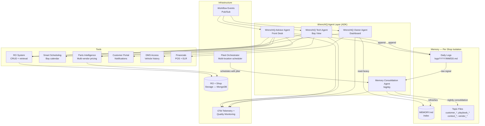
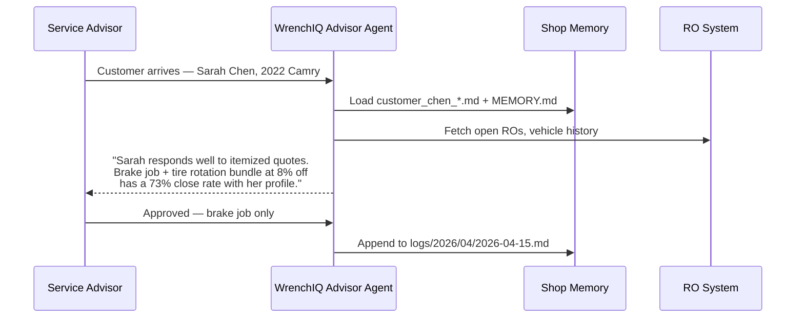
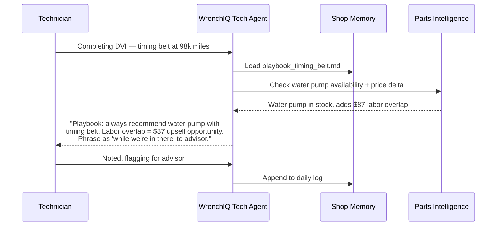
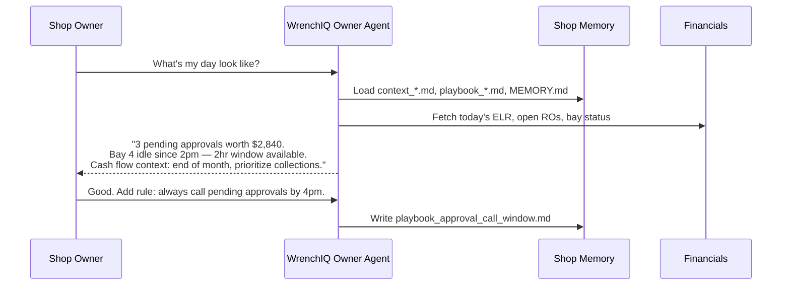
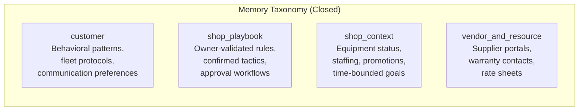
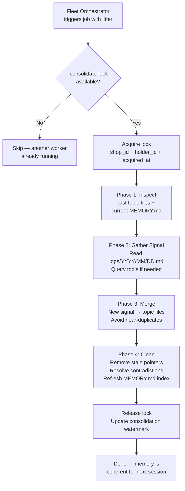
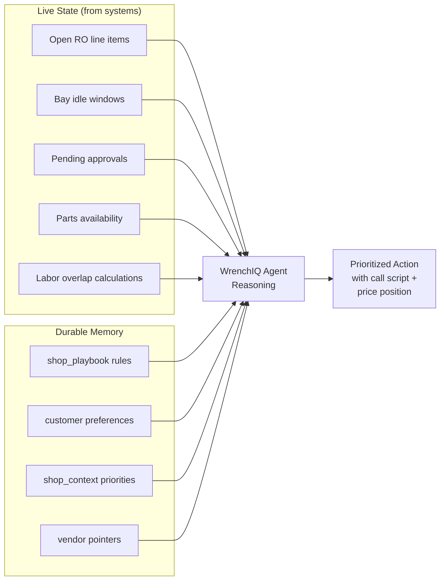
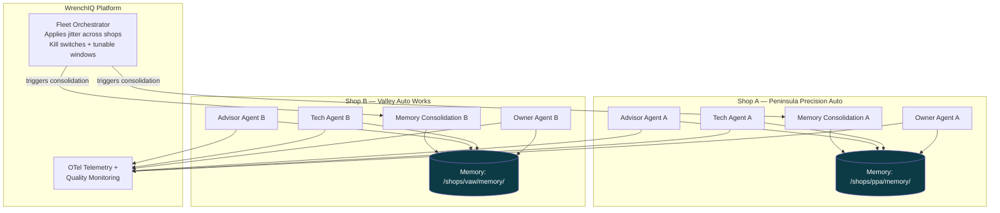

# WrenchIQ Omnipresent Agent: Memory + Architecture

**Product:** WrenchIQ AI (AM Edition)
**Version:** 1.0
**Date:** 2026-04-15
**Owner:** Predii, Inc.
**Classification:** PREDII CONFIDENTIAL

---

## Design Principle

The WrenchIQ agent combines **live shop system state** (RO system, DMS, scheduling board, bay status) with **durable memory** for anything that is not reliably derivable from those systems alone. If you can look it up in the DMS or parts catalog, it does not belong in memory.

Memory holds:
- Behavioral nuance about customers and accounts
- Owner-validated playbooks and shop rules
- Transient operational context (staffing, equipment, promotions)
- Pointers to external resources and vendors

---

## System Overview



---

## Agent Topology

All real-time surfaces share the **same memory directory** for a given shop. `MEMORY.md` is loaded into each agent's context at session start. Topic files are pulled on demand when relevant.

### Agent Name Mapping

| PDF Name | WrenchIQ Name | Persona | WrenchIQ Screen |
|---|---|---|---|
| Front Desk Advisor | **WrenchIQ Advisor Agent** | `advisor` | Check-in, RO Board, Trust Engine |
| Bay Advisor | **WrenchIQ Tech Agent** | `tech` | Tech Mobile View, DVI |
| Owner Dashboard Advisor | **WrenchIQ Owner Agent** | `owner` | Analytics, Command Center |
| Nightly Consolidation | **Memory Consolidation Agent** | background worker | — |
| Fleet Scheduler | **WrenchIQ Fleet Orchestrator** | platform-tier | Multi-Location Screen |

---

### WrenchIQ Advisor Agent (Front Desk)

**Persona:** `advisor` | **Panel:** `WrenchIQAgent.jsx` in advisor context

Responsibilities:
- Check-in guidance, upsell framing, fleet account protocol
- Surfaces relevant customer memory (payment preferences, approval thresholds, communication style)
- Appends timestamped events to daily log (approvals, overrides, fleet snags)
- Drives the **Trust Engine** screen recommendations



---

### WrenchIQ Tech Agent (Bay View)

**Persona:** `tech` | **Panel:** `WrenchIQAgent.jsx` in tech context

Responsibilities:
- Inspection add-on recommendations during DVI
- Parts reality checks (availability, cross-references, lead times)
- How to phrase recommendations to the service advisor
- Appends inspection findings and bay events to daily log



---

### WrenchIQ Owner Agent (Dashboard)

**Persona:** `owner` | **Screen:** Analytics, Command Center, Multi-Location

Responsibilities:
- End-of-day synthesis and digest
- Revenue pipeline visibility (pending approvals, bay utilization)
- Read-heavy with controlled writes (captures owner reactions as playbook updates)
- Drives the **Analytics** and **Command Center** screen insights



---

## Memory Architecture

### Four Memory Types



| Type | Stores | Does NOT store |
|---|---|---|
| `customer` | How to work with this customer *next time* | What happened (that's CRM) |
| `shop_playbook` | Owner corrections + confirmed tactics + Why/How | Catalog data, list prices |
| `shop_context` | Current conditions systems don't model; dated | HR records, certifications |
| `vendor_and_resource` | Pointers to external truth | Full RO payloads |

---

### Memory Layout: Index + Topics + Daily Logs

```
/platform/shops/{shop-id}/memory/
├── MEMORY.md                          # Index — loaded at every session start
│                                      # ~200 lines max, pointer-only
├── customer_chen_preferences.md       # One file per memory topic
├── customer_kim_fleet_protocol.md
├── playbook_upsell_timing.md
├── playbook_brake_bundle_discount.md
├── context_surge_week_apr2026.md
├── vendor_worldpac_brake_parts.md
├── logs/
│   └── 2026/
│       └── 04/
│           └── 2026-04-15.md          # Append-only raw signal during business day
└── .consolidate-lock                  # Per-shop lock (or DB row equivalent)
```

**MEMORY.md** (index format):
```markdown
- [Sarah Chen preferences](customer_chen_preferences.md) — itemized quotes, approves spend herself, no financing offers
- [Kim Fleet protocol](customer_kim_fleet_protocol.md) — PO required >$500, call Mike not Lisa
- [Brake bundle playbook](playbook_brake_bundle_discount.md) — 8% bundle with rotors improved close rate 23%
- [Water pump with timing belt](playbook_upsell_timing.md) — always recommend when timing belt; labor overlap justification
```

---

## Nightly Memory Consolidation

The **Memory Consolidation Agent** runs once per shop after local close. It receives one structured prompt and turns raw daily logs into tighter, non-contradictory topic memories.



**Lock semantics:**
- On-prem: lock file in shop memory directory with holder ID + acquisition time; 1-hour stale timeout
- Cloud: DB row `(shop_id, holder_id, acquired_at)` or S3 object colocated with memory prefix
- On failure: roll back consolidation watermark so next window can retry

---

## Real-Time Guidance: Memory + Live State

The agents combine two signal sources for every recommendation:



### Example Scenarios

**Discount on a brake job**
| Source | Signal |
|---|---|
| Live | Bay idle window; customer vehicle + prior inspection flags |
| Memory | Playbook on bundles; context on competitor promos; customer price sensitivity |
| Output | Ties idle capacity to concrete call script + price position without contradicting playbook rules |

**Related repair (timing belt)**
| Source | Signal |
|---|---|
| Live | Open RO line items, labor overlap, parts availability |
| Memory | Playbook ("always recommend water pump with timing belt when..."); customer history of accepting similar add-ons |
| Output | Phased recommendation with labor overlap justification pre-scripted for advisor |

**What to do right now**
| Source | Signal |
|---|---|
| Live | Pending approvals, bay completion times, clock time |
| Memory | shop_context (cash flow priority); playbook (call window before end-of-day traffic) |
| Output | Ordered action queue combining structured live queries with durable priorities |

---

## Multi-Tenant Cloud: Many Shops, One Platform



**Isolation guarantee:** No cross-shop memory reads. Each shop's agents read and write only their own memory prefix. Locks are per-shop, never global across the fleet.

### Three Platform Tiers

| Tier | WrenchIQ Component | Runtime Model |
|---|---|---|
| **Real-time advisors** | Advisor Agent, Tech Agent, Owner Agent | Stateless request/response; continuity from memory on disk, not permanent processes |
| **Nightly consolidation** | Memory Consolidation Agent | Scheduled per shop after local close; one run at a time; lock-protected |
| **Fleet orchestration** | WrenchIQ Fleet Orchestrator | Enqueues jobs with jitter; kill switches; tunable windows for incidents |

---

## What Not to Store in Memory

| Do NOT store | Why | Where it lives instead |
|---|---|---|
| Vehicle service history | Retrievable from DMS on demand | DMS / SMS adapter |
| Part numbers + list prices | Change frequently; catalog is authoritative | Parts Intelligence tool |
| HR records (certifications, employment) | Not agent-relevant operational data | HR system |
| Live schedule + bay board | Must be read from system of record | Smart Scheduling screen |
| Full RO payloads | Reference by ID only | MongoDB RO collection |

**Memory is for:** `customer` behavior, `shop_playbook` rules, `shop_context` that systems do not model, and `vendor_and_resource` pointers.

---

## Backend Implementation Notes

| Component | File | Notes |
|---|---|---|
| Agent routing | `server/routes/roAgent.js` | WrenchIQ Advisor + Tech agent endpoints |
| Agent service | `server/services/aroAgentService.js` | Core agent orchestration logic |
| Memory storage | MongoDB per-shop collections | `memory_index`, `memory_topics`, `memory_logs` |
| LLM calls | `server/config.js` | Model + token config; never hardcode |
| Recommendation engine | `server/services/recommendationLLM.js` | Strips meta-commentary from output |
| Pub/Sub events | `server/routes/knowledgeGraph.js` | Workflow event triggers |
| Telemetry | OTel (to be wired) | Quality monitoring across all agents |

---

*Predii, Inc. — PREDII CONFIDENTIAL*
